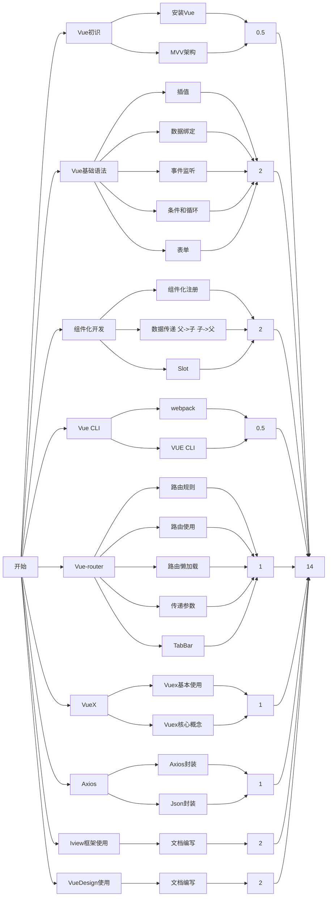

# 目录说明与计划

## 1.Vue知识目录结构

```mermaid
graph LR
	start[开始] --> input1[Vue初识]
	input1 --> input1_1[安装Vue]
	input1 --> input1_2[MVV架构]
	input1_1 --> input_1_date[0.5]
	input1_2 --> input_1_date[0.5]
	start --> input2[Vue基础语法]
	input2 --> input2_1[插值]
	input2 --> input2_2[数据绑定]
	input2 --> input2_3[事件监听]
	input2 --> input2_4[条件和循环]
	input2 --> input2_5[表单]
	input2_1 --> input_2_date[2]
	input2_2 --> input_2_date[2]
	input2_3 --> input_2_date[2]
	input2_4 --> input_2_date[2]
	input2_5 --> input_2_date[2]
	start --> input3[组件化开发]
	input3 --> input3_1[组件化注册]
	input3 --> input3_2[数据传递 父->子 子->父]
	input3 --> input3_3[Slot]
	input3_1 --> input_3_date[2]	
	input3_2 --> input_3_date[2]	
	input3_3 --> input_3_date[2]	
	start --> input4[Vue CLI]
	input4 --> input4_1[webpack]
	input4 --> input4_2[VUE CLI]
	input4_1 --> input_4_date[0.5]	
	input4_2 --> input_4_date[0.5]	
	start --> input5[Vue-router]
	input5 --> input5_1[路由规则]
	input5 --> input5_2[路由使用]
	input5 --> input5_3[路由懒加载]
	input5 --> input5_4[传递参数]
	input5 --> input5_5[TabBar]
	input5_1 --> input_5_date[1]	
	input5_2 --> input_5_date[1]	
	input5_3 --> input_5_date[1]	
	input5_4 --> input_5_date[1]	
	input5_5 --> input_5_date[1]	
	start --> input6[VueX]
	input6 --> input6_1[Vuex基本使用]
	input6 --> input6_2[Vuex核心概念]
	input6_1 --> input_6_date[1]	
	input6_2 --> input_6_date[1]	
	start --> input7[Axios]
	input7 --> input7_1[Axios封装]
	input7 --> input7_2[Json封装]
	input7_1 --> input_7_date[1]
	input7_2 --> input_7_date[1]
	start --> input8[Iview框架使用]
	input8 --> input8_1[文档编写]
	input8_1 --> input_8_date[2]
	start --> input9[VueDesign使用]
	input9 --> input9_1[文档编写]
	input9_1 --> input_9_date[2]
	input_1_date --> stop[14]
	input_2_date --> stop
	input_3_date --> stop
	input_4_date --> stop
	input_5_date --> stop
	input_6_date --> stop
	input_7_date --> stop
	input_8_date --> stop
	input_9_date --> stop
```

