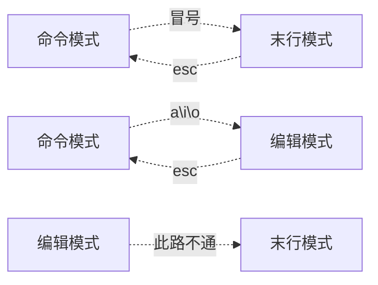

# 基本使用
## 1. 文件管理
```shell
cd      切换文件目录
> cd /tmp 							//切换到tmp目录
```
```shell
mkdir 	创建文件夹
> mkdir /tmp/test   		//在tmp目录下创建test文件夹
> mkdir -p /tmp/a/b/c  	//创建多级目录
```
## 2. VIM编辑器
```shell
	vim /tmp/test          // 编辑/tmp下的test文件
```


```shell
#命令模式
	> dd // 删除1行
	  - 10yy 	// 删除10行
		- d$ 		// 当前位置删除到行尾
		- d^ 		// 当前位置删除到行首
		
	> yy   		// 复制1行
		-	10yy	// 复制10行
	> p    		// 粘贴
	> $		 		// 到行尾部
	> ^				// 到行首
#末行模式
	> set number 显示行号
	> :wq 		// 保存并推出
		- :wq!  // 强制保存并退出
	> :q			// 退出（未做任何修改）
		- :q!		// 强制退出
	> /findword	// 查找 “findword” 在本文件位置
		- n			// 向下查找
		- N			// 向上查找
#编辑模式
	> a 			// 在当前字符`后`进行插入
	> i				// 在当前字符进行插入
	> o				// 换行进行插入
```

## 3. 压缩命令

