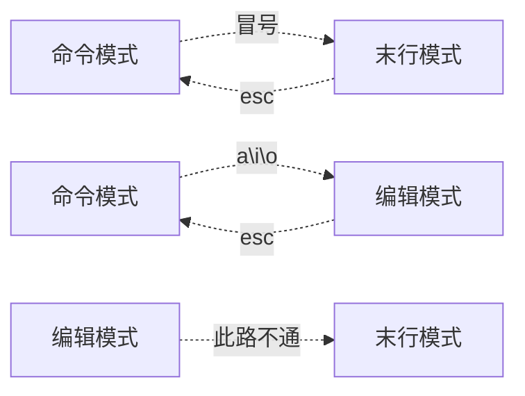

# 基本使用
## 1. 文件管理
  - cd      切换文件目录
```shell
cd /tmp 							#切换到tmp目录
```
  - ls 	 # 查看当前文件夹下的文件/文件夹

```shell
ls -l # 长格式查看文件
    [root@rhel6 test]# ls -l /etc/
    总用量 2040
    drwxr-xr-x.  3 root   root     4096 10月 27 21:30 abrt

ls -lh # 长格式查看，格式化显示当前文件大小
  	[root@rhel6 test]# ls -lh
    总用量 32K
    -rw-r--r--. 1 root root 1.2K 12月  4 22:34 a.gz
    -rw-r--r--. 1 root root  10K 12月  4 21:59 a.tar
```
  - 创建文件夹
```shell
mkdir 	创建文件夹
  - mkdir /tmp/test   		#在tmp目录下创建test文件夹
  - mkdir -p /tmp/a/b/c  	#创建多级目录
```
  - 创建文件
```shell
touch test.txt		
```
  - 查看文件
```shell
cat /etc/fstab		# 查看文件
	  - 这会直接在控制台中查看所有文件，如果文件较大，展示时间较长
less /etc/fstab   # 分页查看文件
    - 空格	 # 查看下一页
    - q			#  退出
more /etc/fstab	  # 分页查看文件
    - 空格	 # 查看下一页
    - q			#  退出
    - control + C # 退出
head -10 /etc/fstab	# 查看fstab文件的前10行
tail -10 /etc/fstab # 查看fstab文件的后10行
	-f # 会追加的查看 （看日志十分有用）
```

  - 文件控制

```shell
cp /etc/fstab	/tmp  # 复制文件
	-r # 复制多层目录/文件
mv /tmp/fstab /			# 移动文件到指定目录 也可以重命名
rmdir /tmp/test			# 删除文件夹
rm -rf /tmp					# 删除tmp文件夹下的所有东西   `慎用！！`
```

  - 查找文件

```shell
find / -name fstab.  # 从根目录下查找·fstab·文件
```

  - 查找命令

```shell
which cd	# 查找cd 命令所在目录
```

## 2. VIM编辑器

```shell
	vim /tmp/test          # 编辑/tmp下的test文件
```


```shell
#命令模式
	  - dd # 删除1行
		- 10yy  # 删除10行
		- d$ 		# 当前位置删除到行尾
		- d^ 		# 当前位置删除到行首
		
	  - yy      # 复制1行
		- 10yy  # 复制10行
	  - p       # 粘贴
	  - $		    # 到行尾部
	  - ^		    # 到行首
#末行模式
	  - set number 显示行号
	  - :wq         # 保存并退出
		- :wq!      # 强制保存并退出
	  - :q          # 退出（未做任何修改）
		- :q!       # 强制退出
	  - /findword	# 查找 “findword” 在本文件位置
		- n			# 向下查找
		- N			# 向上查找
	  - /s/aaa/bbb/g  # 全局将aaa 替换成bbb
#编辑模式
	  - a 			# 在当前字符`后`进行插入
	  - i				# 在当前字符进行插入
	  - o				# 换行进行插入
```

## 3. 压缩命令

3.1 tar 方式进行压缩.  
  - tar -cvf `压缩成的文件名` `将要压缩的文件/文件夹`
  - eg: tar -cvf a.tar a

``` shell
tar 
	-cvf		# c:创建压缩文件  v:查看解压过程  f:压缩文件
	-xvf		# x:解压文件  v:查看解压过程  f:压缩文件
	
	-zcvf		# 以gzip 方式进行压缩
	-zxvf		# 以gzip 方式进行解压

	-jcvf		# 以bzip 方式进行压缩
	-jxvf		# 以bzip 方式进行解压

	-Jcvf		# 以xz 方式进行压缩
	-Jxvf		# 以xz 方式进行解压
```

  - zip 以zip方式进行压缩

```shell
zip test.zip test.  # test.zip 压缩成文件名。 test:将要压缩的文件
unzip test.zip			# 解压zip文件
```

  - gzip 方式进行压缩

```shell
gzip a.gz a 
gunzip a.gz
```

  - 示例

  ```shell
  # 不容压缩方式进行
  [root@rhel6 test]# ls -lh
  总用量 32K
  -rw-r--r--. 1 root root 1.2K 12月  4 22:34 a.gz      #gzip 
  -rw-r--r--. 1 root root  10K 12月  4 21:59 a.tar     #tar
  -rw-r--r--. 1 root root 1.4K 12月  4 22:01 a.tar.bz  #tar 完成后，bzip进行压缩
  -rw-r--r--. 1 root root 1.3K 12月  4 22:01 a.tar.gz  #tar 完成后，gzip进行压缩
  -rw-r--r--. 1 root root 1.4K 12月  4 22:02 a.tar.xz  #tar 完成后，xz 进行雅座
  -rw-r--r--. 1 root root 1.3K 12月  4 22:28 a.zip			#zip 方式进行压缩
  ```

# 4.管道符与重定向

## | 前面的输出作为后面的输入

```shell
ps -ef | grep java   # 查看进程中的java进程
```

## > 重定向

  - 重定向符前面的输出会放到后面的文件中 `直接进行覆盖`

```shell
[root@rhel6 test]# ls -l /etc/   - /tmp/list.txt
[root@rhel6 test]# wc -l /tmp/list.txt    查看文件的行数
502 /tmp/list.txt
[root@rhel6 test]# ls -l /etc/   - /tmp/list.txt
[root@rhel6 test]# wc -l /tmp/list.txt    查看文件的行数
502 /tmp/list.txt
```

## >> 前面的输出会追加的放到文件里

```shell
[root@rhel6 test]# ls -l /etc/ >  - /tmp/list.txt
[root@rhel6 test]# wc -l /tmp/list.txt    查看文件的行数
502 /tmp/list.txt
[root@rhel6 test]# ls -l /etc/ >  - /tmp/list.txt
[root@rhel6 test]# wc -l /tmp/list.txt    查看文件的行数
753 /tmp/list.txt

```

# 5. 过滤

```shell
cat /etc/fstab | grep root   过滤出有root 的行
```


