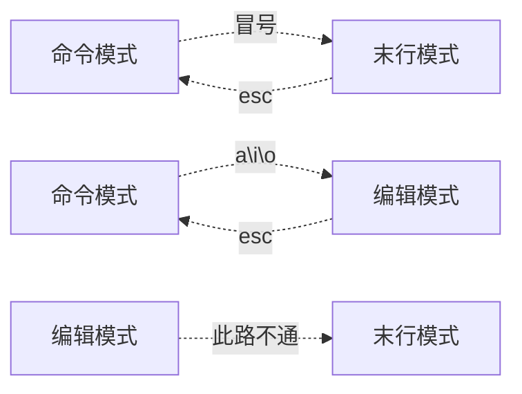

# 基本使用
## 文件管理
```shell
cd      切换文件目录
> cd /tmp 							//切换到tmp目录
```
```shell
mkdir 	创建文件夹
> mkdir /tmp/test   		//在tmp目录下创建test文件夹
> mkdir -p /tmp/a/b/c  	//创建多级目录
```
## VI编辑器
```shell
	vi /tmp/test          // 编辑/tmp下的test文件
```


```shell
#命令模式
	
#末行模式

#编辑模式
```